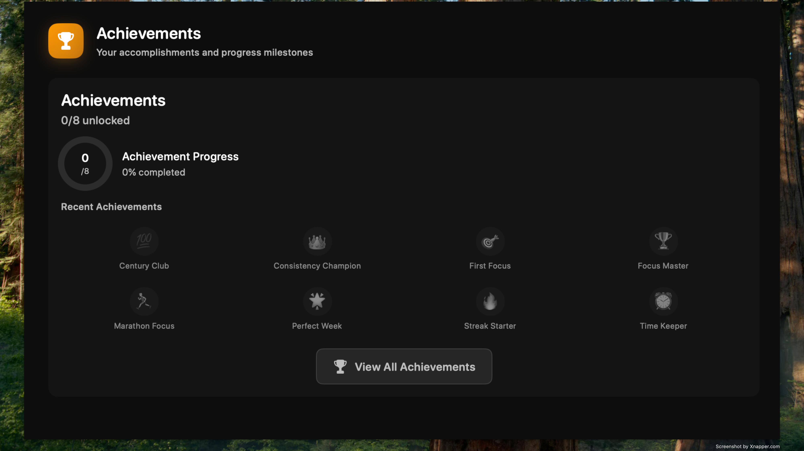
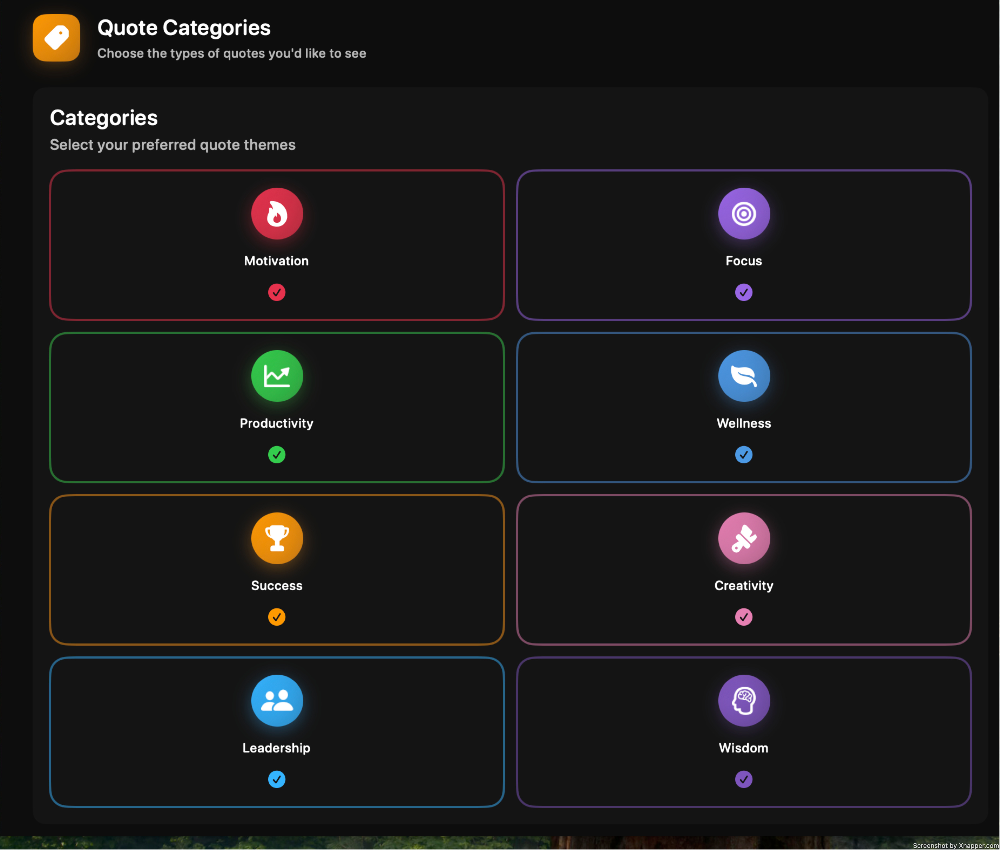

# MindraTimer

A beautiful and intuitive productivity timer for macOS that helps you stay focused and track your progress.


## Features

### Focus Timer
- Customizable work and break sessions
- Beautiful, distraction-free interface
- Visual and audio notifications
- Progress tracking and statistics


### Achievement System
- Track your productivity milestones
- Unlock achievements as you progress
- View your accomplishments and progress



### Statistics and Progress
- Detailed insights into your productivity
- Visual progress tracking
- Session history and trends


### Profile and Settings
- Customize your experience
- Set your preferences
- View your profile information


### Sound Settings
- Choose from various notification sounds
- Adjust volume and preferences
- Customize your audio experience


### Motivational Quotes
- Inspirational quotes to keep you motivated
- Different categories to choose from
- Regular updates with new content



## Download

Visit the [Releases page](https://github.com/MisterMath0/MindraTimer/releases) to download the latest version.

## Developer

Created by [MisterMatt](https://github.com/MisterMath0)

## License

This project is licensed under the MIT License - see the LICENSE file for details.

## Creating Releases

Push a version tag to trigger a release:

```bash
git tag v1.0.0
git push origin v1.0.0
```

This will automatically:
- Build the app
- Create a DMG installer  
- Upload to GitHub Releases

## Manual Release Trigger

You can also trigger releases manually from the GitHub Actions tab.

## Downloads

Visit the [Releases page](https://github.com/MisterMath0/MindraTimer/releases) to download the latest DMG.

--